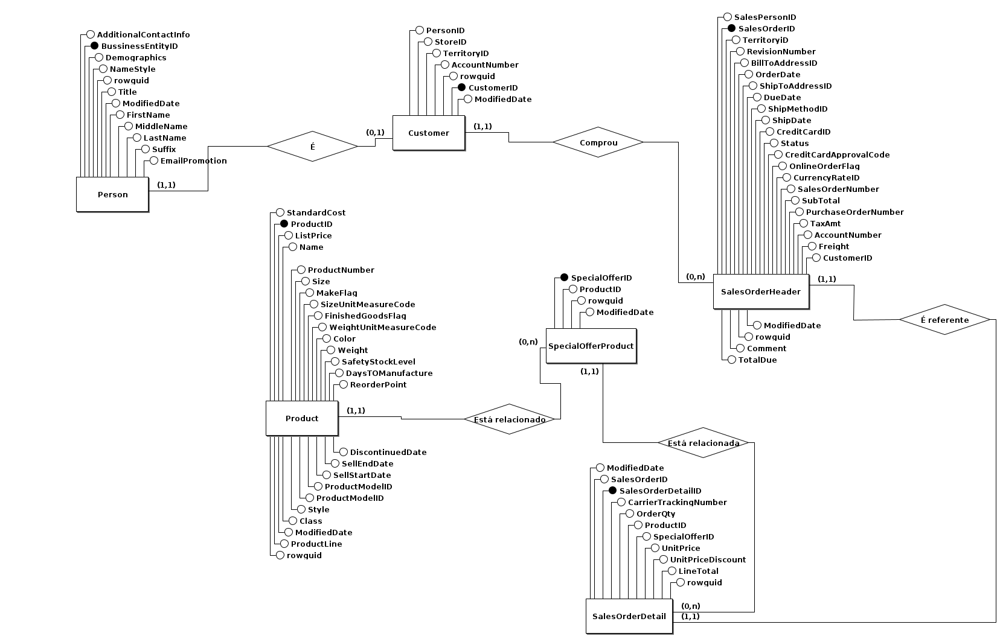

# Desafio Rox

#### Parte 1 - Modelagem Conceitual dos Dados

Na primeira parte do desafio foi passado dados para a análise e criação do modelo conceitual. Para a criação do modelo conceitual 
foi utilizado a ferramenta Br-Modelo na cris dos modelos de entidade-relacionamento e lógico, como também, os comandos de criação das tabelas.

##### Modelo Conceitual

##### Modelo Lógico

##### Comandos para criação das tabelas

[link]()

#### Parte 2 - Criação da Infraestrutura