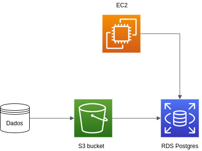
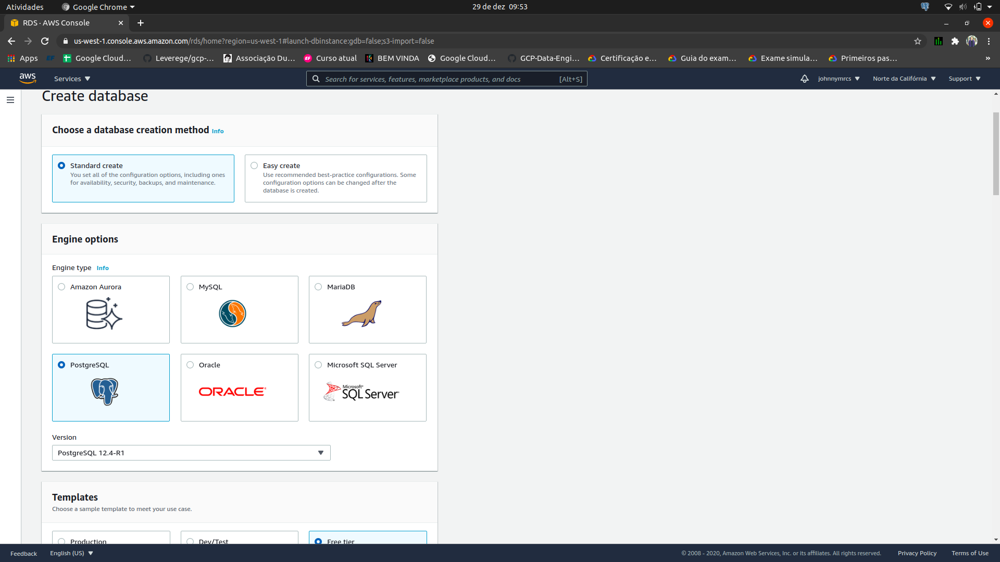
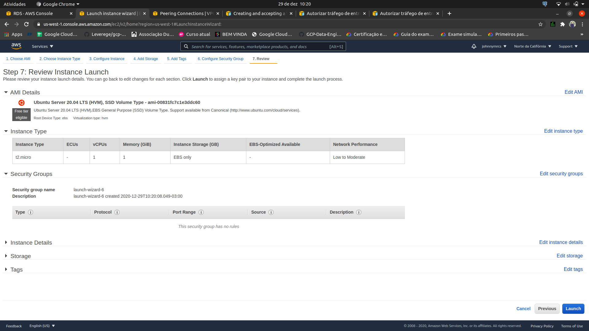

# Desafio Rox


#### Parte 1 - Modelagem Conceitual dos Dados

Na primeira parte do desafio foi passado dados para a análise e criação do modelo conceitual. Para a criação do modelo conceitual 
foi utilizado a ferramenta Br-Modelo na cris dos modelos de entidade-relacionamento e lógico, como também, os comandos de criação das tabelas.

Foi criado um [jupyter notebook](https://github.com/johnnyy/desafio-rox/blob/main/notebook/Analise.ipynb) para analisar os dados e verificar os dados faltantes e visualizar os dados no formato de data frame, apenas para fins de facilidade de análise das colunas

##### Modelo Conceitual


##### Modelo Lógico


##### Comandos para criação das tabelas

[código para criação das tabelas](https://github.com/johnnyy/desafio-rox/blob/main/consultas/banco.txt)

#### Parte 2 - Criação da Infraestrutura




A infraestrutura foi criada na AWS, mais especificamente:
 
- O banco de dados Postgres foi criado no AWS RDS
- Foi criado uma máquina virtual no EC2 para realizar a configuração do banco, porém,
poderia ter sido feito na máquina local.
- Os arquivos foram inseridos em um bucket do AWS S3

  
##### AWS RDS

O banco de dados foi criado com ip público, porém foi limitado para ser acessado pelos ips do grupo de segurança no qual a máquina virtual estava.



##### AWS EC2

Depois, foi criado a máquina virtual no EC2 para acessar o banco de dados com o psql para criar as tabelas.



A máquina virtual foi acessada via ssh e com a tilizando do comando ``` psql -U postgres -h database-desafio.ccjhtjg8upfl.us-west-1.rds.amazonaws.com``` foi possivel acessar o banco de dados e realizar as criações dos esquemas e das tabelas.


#### Parte 3 - Criação dos artefatos para carregador os dados

##### Criação do bucket e permissão
Foi criado um bucket chamado desafio00, no qual foi criado uma Política do IAM para dar permissão ao AWS RDS para carregar os dados armazenados no bucket desafio00.
```
{
    "Version": "2012-10-17",
    "Statement": [
        {
            "Sid": "VisualEditor0",
            "Effect": "Allow",
            "Action": [
                "s3:GetObject",
                "s3:ListBucket"
            ],
            "Resource": [
                "arn:aws:s3:::desafio00/*",
                "arn:aws:s3:::desafio00",
            ]
        }
    ]
}
```
Em seguida, foi criado uma role para ser atribuído a permissão descrita na política acima. E essa role foi atribuída a instáncia do banco de dados no RDS.


##### Processamento dos dados e Upload

Para realizar o upload dos dados no bucket do S3, os dados foram copiados no console para serem inseridos no bucket, porém,
pode ser utilizado a ferramenta de cliente para inserir os dados nos buckets.

Para realizar o o carregamento dos dados no banco de dados, foi utilizada a ferramenta de upload de dados do RDS que utiliza o S3.
Essa ferramenta pode ser instalada com o comando ```CREATE EXTENSION aws_s3 CASCADE;``` no psql. Depois pode ser utilizado o comando:

```
SELECT aws_s3.table_import_from_s3
    ('<schema.table_name>',
    '',  -- Lista de colunas transferidas
    '(FORMAT CSV, HEADER true, DELIMITER '';'')',
    'nome_do_bucket',
    'nome_do_arquivo',
    'região do banco de dados'
    );
```
Porém, o delimitador ```;``` não pode ser utilizado nessa ferramenta, portanto, os dados foram atualizados para utilizar o delimitador ```|```, por esse motivo, foi utilizado a ferramenta de linha de comando sed para atualizar os dados e trocar as ocorrências de ```;``` por ```|```. 

```
sed -i 's/;/|/g' arquivo.csv
```

Por fim, utilizando o novo delimitador, foi possível carregar os dados no RDS à partir do s3.

#### Parte 4 - Análise de dados

As consultas sobre os dados estão neste [arquivo](https://github.com/johnnyy/desafio-rox/blob/main/consultas/analise.txt), porém, serão apresentadas aqui.

1. Escreva uma query que retorna a quantidade de linhas na tabela Sales.SalesOrderDetail pelo campo SalesOrderID, desde que tenham pelo menos três linhas de detalhes.

```
SELECT sales_d.SalesOrderID, count(*)
FROM sales.salesOrderDetail as sales_d
GROUP BY sales_d.SalesOrderID
HAVING count(*) >=3;
```

2. Escreva uma query que ligue as tabelas Sales.SalesOrderDetail, Sales.SpecialOfferProduct e Production.Product e retorne os 3 produtos (Name) mais vendidos (pela soma de OrderQty), agrupados pelo número de dias para manufatura (DaysToManufacture).
```
SELECT prd.name
FROM sales.salesorderdetail as sale_d, sales.specialofferproduct as sp_prd, production.product as prd 
WHERE sale_d.specialofferid = sp_prd.specialofferid 
    and sp_prd.productID = prd.productID 
GROUP BY prd.daystomanufacture, prd.productID
LIMIT 3;
```

3. Escreva uma query ligando as tabelas Person.Person, Sales.Customer e Sales.SalesOrderHeader de forma a obter uma lista de nomes de clientes e uma contagem de pedidos efetuados.

```
SELECT per.firstname, count(*)
FROM person.person as per, sales.customer as sales_c, sales.salesorderheader as sales_h 
WHERE per.BussinessEntityID = sales_c.PersonID 
    and sales_h.customerID = sales_c.customerID
GROUP BY per.BussinessEntityID;
```

4. Escreva uma query usando as tabelas Sales.SalesOrderHeader, Sales.SalesOrderDetail e Production.Product, de forma a obter a soma total de produtos (OrderQty) por ProductID e OrderDate.

```
SELECT prd.ProductID, sum(sales_d.OrderQty)
FROM sales.salesorderheader as sales_h, sales.salesorderDetail as sales_d, production.product as prd 
WHERE sales_h.SalesOrderID = sales_d.SalesOrderID 
    and prd.ProductID = sales_d.ProductID
GROUP BY prd.ProductID, sales_h.OrderDate;
```
  

5. Escreva uma query mostrando os campos SalesOrderID, OrderDate e TotalDue da tabela Sales.SalesOrderHeader. Obtenha apenas as linhas onde a ordem tenha sido feita durante o mês de setembro/2011 e o total devido esteja acima de 1.000. Ordene pelo total devido decrescente.

```
SELECT sales_h.SalesOrderID, OrderDate, TotalDue
FROM sales.salesOrderHeader as sales_h
WHERE extract(year from sales_h.orderdate) = 2011 
    and extract(month from sales_h.orderdate) = 09
    and sales_h.TotalDue > 1000
ORDER BY sales_h.TotalDue DESC;
```